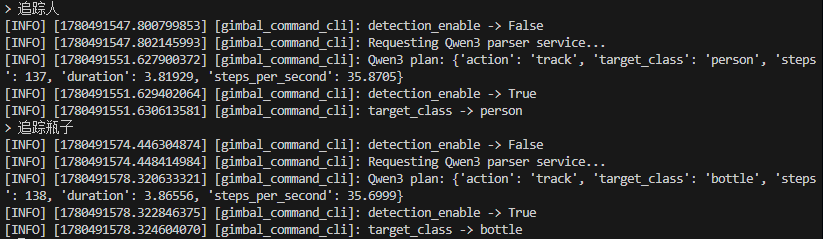

# -Jetson-Orin-Nano-Qwen3-TensorRT-
完成 Jetson Orin Nano 端大模型推理框架适配，梳理Tensor – Buffer - Allocator -Layer -Model-Kernel 分层架构，并跑通 Qwen3-0.6B / Llama 的 C++/CUDA 本地推理。实现自然语言控制云台追踪。
联系邮箱：983238425@qq.com
演示视频：B站：治雨王啊
## Demo



## Features

- Qwen3-0.6B 本地推理
- INT8 weight-only 量化推理
- YOLOv8 TensorRT 实时目标检测
- Jetson CSI / USB 摄像头输入
- ROS2 云台控制链路
- Feetech 串口舵机控制
- Qwen3 自然语言指令解析
- CUDA / TensorRT 边缘端加速

## Hardware

- NVIDIA Jetson Orin Nano
- JetPack 6.x
- CUDA 12.x
- CSI Camera 或 USB Camera
- Feetech UART Servo

## 学习资源

- AI Infra: https://caomaolufei.github.io/AIInfraGuide(AI Infra啥也不明白的可以看这个)
- B站：傅傅猪，LLM推理框架(付费)
- TensorRT:看我代码里的yolo就行，推理框架就是比较固定的，我也只是做了yolo前后端的CUDA优化
- CUDA/Tensor core:https://github.com/Bruce-Lee-LY/cuda_hgemm;https://github.com/siboehm/SGEMM_CUDA；
  https://github.com/xlite-dev;
  
## System Architecture

```text
User Command
    |
    v
Qwen3 INT8 HTTP Parser
    |
    v
JSON Control Plan
    |
    v
ROS2 Command Node
    |
    v
YOLOv8 TensorRT Gimbal Node
    |
    v
Servo / Camera Tracking

Supported Commands
追踪人   -> track person
找人     -> track person
追踪瓶子 -> track bottle
找瓶子   -> track bottle
停止     -> disable tracking
暂停     -> disable tracking
继续     -> enable tracking
恢复     -> enable tracking
Example JSON output:

{"action":"track","target_class":"bottle"}
{"action":"enable","enabled":false}
Quick Start
1. Jetson Performance Mode
sudo nvpmodel -m 0
sudo jetson_clocks
2. Start Qwen3 INT8 Service
sudo docker start -ai kuiper-qwen3-fixed

cd /workspaces/KuiperLLama

export LD_LIBRARY_PATH=/workspaces/KuiperLLama/lib:$LD_LIBRARY_PATH
unset KUIPER_PROFILE_INT8_MATMUL
export KUIPER_INT8_FFN_ROWS=4
export KUIPER_INT8_LMHEAD_ROWS=4
export KUIPER_FUSED_INT8_LMHEAD=1

python3 apps/qwen3_server/qwen3_http_server.py \
  --host 127.0.0.1 \
  --port 18080 \
  --model /models/qwen3-0.6b/qwen3-int8.bin \
  --tokenizer /models/qwen3-0.6b/tokenizer.json \
  --int8 \
  --max-steps 24 \
  --timeout 120
3. Start YOLO ROS2 Node
cd /home/ubuntu/LLM/KuiperLLama-Q/yolo/ros2

source /opt/ros/humble/setup.bash
source install/setup.bash

ros2 run yolov8_gimbal_ros2 yolov8_gimbal_node \
  --ros-args \
  -p engine_path:=/home/ubuntu/LLM/KuiperLLama-Q/yolo/models/yolov8n.engine.Orin.fp16.1.1 \
  -p camera_input:=csi \
  -p target_class:=person \
  -p servo_port:=/dev/ttyUSB0 \
  -p display_window:=false
4. Start Command CLI
cd /home/ubuntu/LLM/KuiperLLama-Q/yolo/ros2

source /opt/ros/humble/setup.bash
source install/setup.bash

ros2 run gimbal_command_ros2 command_cli \
  --ros-args \
  -p qwen_server_url:=http://127.0.0.1:18080/parse
Then input:

追踪瓶子
停止
继续
追踪人
Performance
Module	Result
Qwen3-0.6B INT8	about 20-30 steps/s
YOLOv8 TensorRT	real-time detection
Platform	Jetson Orin Nano
Project Structure
apps/qwen3_server/        Qwen3 HTTP command parser
demo/                     Qwen3 / LLaMA inference demos
kuiper/                   C++ / CUDA LLM inference framework
yolo/                     YOLOv8 TensorRT and ROS2 gimbal control
docs/                     deployment and interview notes
tools/                    model export and quantization tools
Notes
Model weights and TensorRT engines are not included in this repository.

Please place model files manually:

models/qwen3-0.6b/qwen3-int8.bin
models/qwen3-0.6b/tokenizer.json
yolo/models/yolov8n.engine.Orin.fp16.1.1
Recommended .gitignore:

models/
*.bin
*.bin2
*.engine
*.onnx
*.pth
*.safetensors
build/
install/
log/
License
This project is for research and educational use.

